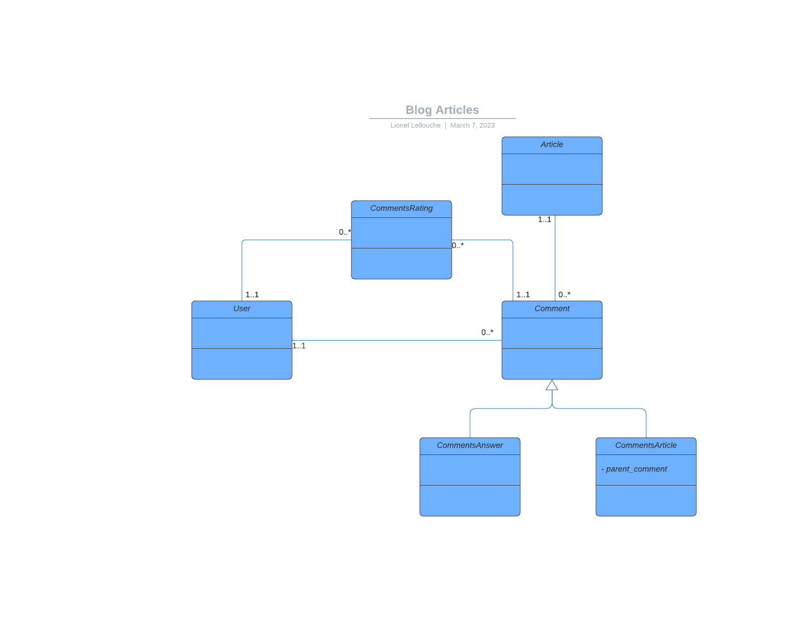

# Blog Article Comments
### Listes des fonctionnalités :
- :white_check_mark: Pouvoir instancier le service de commentaires sur n’importe quelle page
- :white_check_mark: Consulter la liste des commentaires et les réponses aux commentaires
- :white_check_mark: Poster un commentaire
- :white_check_mark: Poster une réponse a un commentaire
- :white_check_mark: Créer un système de notation des commentaire
- :white_check_mark: Sécuriser le formulaire de post de commentaires contre les robots
- :white_check_mark: S’authentifier via Facebook et/ou Google
- :white_check_mark: Mettre en place un système d’autorisation sur les API

## How to install
#### Run project with docker
```
docker compose up -d
```

#### Create "blog" database
```
docker exec -i db_docker_symfony mysql -uroot <<< "CREATE DATABASE blog;"
```

#### Import "blog" database
```
docker exec -i db_docker_symfony mysql -uroot < blog.sql
```

#### Copy env variables
```
cp project/.env.dist project/.env
```

#### Install composer dependencies
```
cd project && composer install && cd ..
```

#### All instruction inline
```
docker compose up -d
docker exec -i db_docker_symfony mysql -uroot <<< "CREATE DATABASE blog;"
docker exec -i db_docker_symfony mysql -uroot < blog.sql
cp project/.env.dist project/.env
cd project && composer install && cd ..
```

## Website usage and features
### [Access to phpMyAdmin here](http://localhost:8080/index.php?route=/database/export&db=blog)
User root, no password

### [Blog articles website](http://localhost:8741)

Website no require connection.

Features that's required connection :
- Load answers of one comment
- Comment one article
- Answer comment
- All API routes required authentication with token

## Technical informations
### Database Schema
### 

[Use Postman collection as API documentation](doc/ArticlesComments.postman_collection.json)


### Used techno
- Doctrine single table inheritance was used to distinct types of comments :
  - ArticleComment (inherit from Comment) : Simple article comment
  - CommentAnswer (inherit from Comment) : Article comment for answer to another exisint comment
  - Comment : All types of comments
- One user can make only one rating peer comment (so rating is updated if exists)
- Social connects with knpuniversity/oauth2-client-bundle
- API OAuth connects with custom [ApiAuthenticator](project/src/Security/ApiAuthenticator.php)
- Robot protections with calculated fields in all post put forms
- DTO usage for transform entities to JSON
- Website is responsive

### Refacto improvements and questions
- Not following OAuth standard in some cases
- Is used DTO to render object, because consign was to avoid "magic" bundle usage like API platform
- So jQuery parts for comments need to be refacto
- Replace generated token by JWT Token
- In real project i would prefer not using jquery, either :
  - Standard symfony form generated (more easy and native secured)
  - Frontend framework like VueJs or Angular